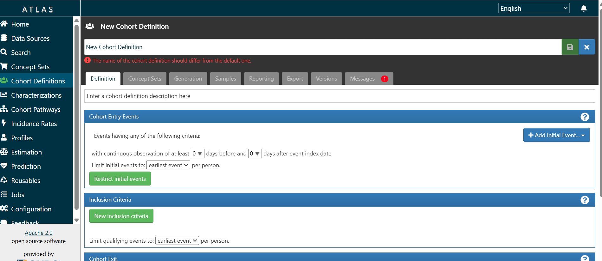

# 🏥 OHDSI Atlas and WebAPI Setup


## 📋 Overview

**OHDSI Atlas** is a web-based platform for exploring healthcare data, defining patient cohorts, conducting observational studies, and developing predictive models within the OHDSI ecosystem [1]. **OHDSI WebAPI** serves as the backend service providing secure access to OMOP Common Data Model (CDM) databases and RESTful API endpoints [2].

This repository provides a **Docker-based deployment** solution that simplifies the complex setup process through pre-configured containers, automated database initialization, and streamlined service management, adopted from OHDSI Broadsea [3].

## ✨ Key Features

- 🐳 **Pre-configured Docker containers** with proper defaults
- 🔄 **Automated database initialization** via populate.py script
- 🚀 **Service dependency management** through Docker Compose
- 🔧 **Traefik reverse proxy** for HTTP/HTTPS routing
- ⚡ **Health checks** ensuring correct startup order

## 🛠️ Prerequisites

-  Docker desktop installed [docker installation](https://www.docker.com/products/docker-desktop))
-  PostgreSQL database with OMOP CDM data
-  Dedicated database user with appropriate permissions

### 🔐 Database Schema Permissions

A dedicated database user must be created with specific schema permissions [4]:

| Schema | Permissions | Description |
|--------|------------|-------------|
| **CDM** | `SELECT` | Read-only access to standardized clinical data |
| **Vocabulary** | `SELECT` | Read-only access to vocabulary tables |
| **Results** | `SELECT, INSERT, UPDATE, DELETE` | Full DML access for analysis results |
| **Temp** | `ALL PRIVILEGES` | Full control for temporary tables |
| **WebAPI** | `ALL PRIVILEGES` | Full access for Flyway migrations |

---
<details>
  <summary><b>💾 User Creation Script</b></summary>

```sql
CREATE USER webapi_user WITH PASSWORD 'your_secure_password';
GRANT CONNECT ON DATABASE your_database TO webapi_user;

-- CDM Schema (Read-only)
GRANT USAGE ON SCHEMA cdm TO webapi_user;
GRANT SELECT ON ALL TABLES IN SCHEMA cdm TO webapi_user;

-- Vocabulary Schema (Read-only)
GRANT USAGE ON SCHEMA vocab TO webapi_user;
GRANT SELECT ON ALL TABLES IN SCHEMA vocab TO webapi_user;

-- Results Schema (Full DML)
GRANT USAGE ON SCHEMA results TO webapi_user;
GRANT SELECT, INSERT, UPDATE, DELETE ON ALL TABLES IN SCHEMA results TO webapi_user;

-- Temp Schema (Full control)
GRANT USAGE, CREATE ON SCHEMA temp TO webapi_user;

-- WebAPI Schema (Full privileges)
GRANT ALL PRIVILEGES ON SCHEMA webapi TO webapi_user;
```
    
</details>

---
## 📊 Recommended Action
To ensure the OMOP CDM is properly characterized for use with Atlas, we strongly recommend running **Achilles** to generate a comprehensive analysis of the data, which will be stored in the Results schema. We recommend using **Achilles version 1.7.0**, as it has been tested and confirmed to work reliably with this setup. Ah!, It did worked for us. 

### Installing Achilles v1.7.0 in R
Achilles is available in the OHDSI GitHub repository: [OHDSI/Achilles](https://github.com/OHDSI/Achilles). Since `install.packages()` does not support installing specific versions directly from CRAN, we recommend using the `devtools` package to install Achilles v1.7.0 from GitHub. Follow these steps in an R environment:

<details>
<summary>📦 View R Code for Installing Achilles v1.7.0</summary>

```R
# Install devtools if not already installed
if (!requireNamespace("devtools", quietly = TRUE)) {
  install.packages("devtools")
}

# Install Achilles v1.7.0 from GitHub
devtools::install_github("OHDSI/Achilles@v1.7.0")

# Verify installation
library(Achilles)
packageVersion("Achilles")  # Should return [1] ‘1.7.0’
```

</details>

### Running Achilles
Below is a sample R script to run Achilles on your OMOP CDM database, storing results in the Results schema.

<details>
<summary>📝 View Sample R Code for Running Achilles</summary>

```R
# Load required libraries
library(DatabaseConnector)
library(Achilles)

# Database connection details
connectionDetails <- DatabaseConnector::createConnectionDetails(
  dbms = "postgresql",
  server = "host.docker.internal/your_database",
  user = "webapi_user",
  password = "your_secure_password",
  port = 5432,
  pathToDriver="xxxx"
)

# Run Achilles analysis
achillesResults <- Achilles::achilles(
  connectionDetails = connectionDetails,
  cdmDatabaseSchema = "cdm",
  resultsDatabaseSchema = "results",
  vocabDatabaseSchema = "vocab",
  tempEmulationSchema = "temp",
  cdmVersion = "5.4",  # Adjust based on your OMOP CDM version - 5.4 is recommended.
  numThreads = 1,      # Adjust based on system resources
  outputFolder = "achilles_output"
)

# View results
print("Achilles analysis completed. Results stored in the 'results' schema.")
```

</details>

**Notes**:
- Replace `host.docker.internal` with `localhost` or `127.0.0.1` for a local PostgreSQL database, or use the external IP/hostname for a remote database.
- Ensure the `webapi_user` has the required permissions on the Results schema to store Achilles output.
- The `outputFolder` parameter specifies where temporary files are saved; ensure this directory exists and is writable.
- Adjust `cdmVersion` to match your OMOP CDM version (e.g., "5.3" or "5.4").

---
## 🚀 Quick Start

### 1. 📥 Clone Repository

```bash
git clone https://github.com/your-username/ohdsi-docker-deployment.git
cd spin_web_api_atlas
```

### 2. ⚙️ Configure Environment

```bash
cp .env.example .env
nano .env
```

#### 🖥️ Local PostgreSQL
```env
WEBAPI_DATASOURCE_URL=jdbc:postgresql://localhost:5432/your_database?user=webapi_user&password=your_secure_password
```

#### 🌐 External PostgreSQL
```env
WEBAPI_DATASOURCE_URL=jdbc:postgresql://your-db-server.example.com:5432/your_database?user=webapi_user&password=your_secure_password
```

### 3. 🚀 Deploy Services

```bash
docker-compose up -d
```

### ✅ Expected Output
```bash
✔ Network spin_web_api_atlas_default          Create...                                      0.1s 
 ✔ Container ohdsi-webapi-3                    Healthy                                      146.7s 
 ✔ Network spin_web_api_atlas_default          Create...                                      0.1s 
 ✔ Container ohdsi-webapi-3                    Healthy                                      146.7s 
 ✔ Container ohdsi-webapi-3                    Healthy                                      146.7s 
 ✔ Container traefik                           Started                                        1.0s 
 ✔ Container spin_web_api_atlas-db-populate-1  Exited                                       152.0s 
 ✔ Container traefik                           Started                                        1.0s 
 ✔ Container spin_web_api_atlas-db-populate-1  Exited                                       152.0s 
 ✔ Container ohdsi-atlas-3                     Started                                      152.4s 
 ✔ Container spin_web_api_atlas-db-populate-1  Exited                                       152.0s 
 ✔ Container ohdsi-atlas-3                     Started                                      152.4s 
 ✔ Container ohdsi-atlas-3                     Started                                      152.4s 
```

### 4. 📊 Monitor Startup

```bash
# View all logs
docker-compose logs -f

# View specific service logs
docker-compose logs -f ohdsi-webapi-3
docker-compose logs -f ohdsi-atlas-3
```
---
### 🌐 Access Applications

| Service | URL | Description |
|---------|-----|-------------|
| **OHDSI Atlas** | `http://127.0.0.1/atlas` | Web-based analytics platform |
| **OHDSI WebAPI** | `http://127.0.0.1/WebAPI/info` | Backend API service |
<div style="display: flex; gap: 10px;">


</div>


## 🐛 Troubleshooting

### Common Issues

| Issue | Solution |
|-------|----------|
| 🔌 **Database Connection Failed** | Verify credentials in `.env` and network connectivity |
| 🚫 **WebAPI Not Starting** | Check database permissions and Flyway migrations, specifically schema_history table in your webapi schema. |
| 🔗 **Atlas Cannot Connect** | Ensure WebAPI is healthy before Atlas starts |

### 🔧 Useful Commands

```bash
# Stop services
docker-compose down

# Clean reset (removes volumes)
docker-compose down -v

# Restart specific service
docker-compose restart ohdsi-webapi-3
```

## 🏆 Credits 

This project is part of the [OHDSI](https://ohdsi.org) and was developed with support from the [eHealth Hub](https://ehealth4cancer.ie).

## 🙏 Acknowledgments

This work builds upon the outstanding contributions of the **Observational Health Data Sciences and Informatics [OHDSI](https://ohdsi.org)** collaborative. We extend our sincere gratitude to the OHDSI community for their dedication to improving healthcare through data.

Special recognition goes to the **OHDSI Broadsea project** for providing the foundational Docker deployment framework.

We also acknowledge **eHealth4Cancer -- [eHealth Hub](https://ehealth4cancer.ie)** for their significant contributions to advancing digital health solutions in oncology research and demonstrating the real-world impact of standardized health data analytics.

## 📚 References

1. [OHDSI Atlas Documentation](https://github.com/OHDSI/Atlas/wiki)
2. [OHDSI WebAPI Documentation](https://github.com/OHDSI/WebAPI/wiki)
3. [OHDSI Broadsea Project](https://github.com/OHDSI/Broadsea)
4. [WebAPI CDM Configuration](https://github.com/OHDSI/WebAPI/wiki/CDM-Configuration)


## 💬 Support

For issues and questions:
- 🔍 Review the troubleshooting section above
- 🐛 Submit issues to the repository's GitHub Issues page

---
<div style="display: flex; gap: 10px;">


</div>